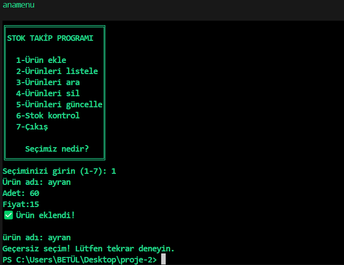
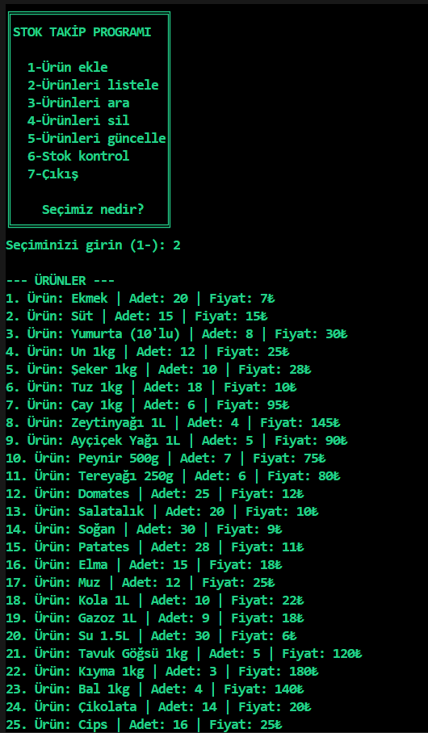
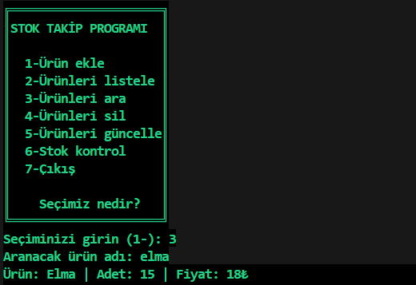
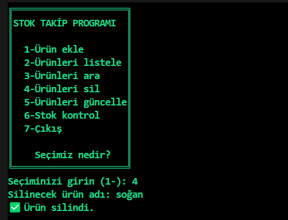
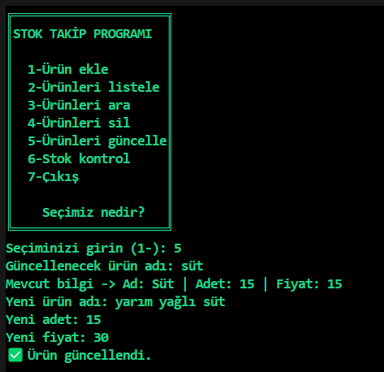
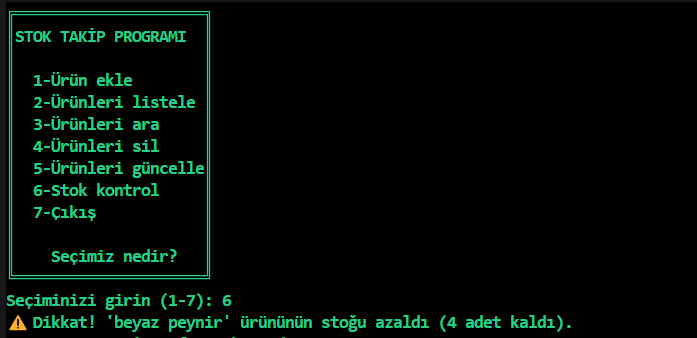
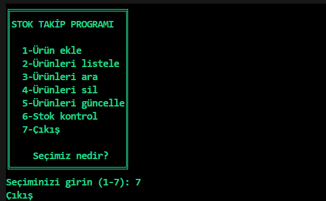

# STOK TAKİP UYGULAMASI
# proje-2
# PHYTON

#PROJE AÇIKLAMASI
-------------------

Bu projede 1 den 7 ye kadar ürünleri ekle, listele,ara,güncelle,sil,stok kontrolü modülleri bulunmaktadır. Bu modüllerden istediğiniz birisini mağazadaki ürünleri sisteme kolaylıkla ekleyip silebilir ve stokta ne kadar mevcut olduğunuayrıca istenen ürünün mağazada olup olmadığını kontrol edebilirsiniz.Projede kullanılan kodlar mevcuttur.Bu proje phyton da konuları daha iyi kavramak ve günlük hayatı kolaylaştırmak amacıyla yapılmıştır.

#ANA MENÜ
-----------

 Burada ürünleri ekle,sil,ara,güncelle,listele ve stok kontrol menüleri bulunmaktadır. 1-7 arası seçim yapabilirsiniz.

-------------------------------------------

#1.ÜRÜNLERİ EKLE
----------------

Burada mağazaya yeni gelen ürünleri ekleyebilirsiniz.

------------------------------------------

#2.ÜRÜNLERİ LİSTELE
----------

Burada mağazadaki bütün ürünleri listeleyip bakabilirsiniz.

------------------------------------------

#3.ÜRÜNLERİ ARA
----------------

Burada mağazada aradığınız bir ürün varsa bakabilirsiniz..

-------------------------------------------

#4.ÜRÜNLERİ SİL
---------------

Burada mağazada artık satılmayan ürünleri silebilirsiniz..

--------------------------------------------

#5.ÜRÜNLERİ GÜNCELLE
---------------

Burada mağazadaki ürünleri güncelleyebilirisiniz.

--------------------------------------------

#6.STOK KONTROL
-------------------------------

Burada mağazadaki ürünleri stokta ne kadar mevcut olduğuna bakabilirsiniz.

--------------------------------------------

#7.ÇIKIŞ
---------------

Buradan da 7 numarayı yazıp çıkış yapabilirisiniz.

--------------------------------------------